# Modelo relacional de identidad

Este modelo cubre usuarios, roles, apartamentos, propietarios y arrendatarios del microservicio de identidad. La definición ejecutable del esquema está en `V1__create_identity_schema.sql`; el diagrama representa esa misma estructura.



La fuente editable del diagrama es [`modelo-identidad.mmd`](modelo-identidad.mmd). El SVG se genera con Mermaid CLI:

```bash
npx --yes @mermaid-js/mermaid-cli -i docs/arquitectura/modelo-identidad.mmd -o docs/arquitectura/modelo-identidad.svg -b transparent
```

## Decisiones del modelo

- `users` concentra credenciales e identidad; `roles` se relaciona muchos a muchos mediante `user_roles`.
- `owners` modela la titularidad entre usuario y apartamento. Admite copropietarios y que una persona posea varias unidades.
- `tenants` conserva periodos de arrendamiento mediante `start_date` y `end_date`; un `end_date` nulo representa el arrendamiento vigente.
- Un apartamento puede tener varios propietarios y varios arrendatarios, de acuerdo con el supuesto del contexto que permite múltiples residentes por unidad.
- Las bajas se representan con estado (`users.status`, `apartments.activo`) para conservar trazabilidad. Las relaciones históricas de arrendamiento no se eliminan al finalizar.

## Restricciones protegidas por PostgreSQL

| Regla | Restricción o índice |
| --- | --- |
| No repetir un apartamento | `uk_apartments_torre_numero` sobre `(torre, numero)` |
| No repetir un correo normalizado | `uk_users_email` y `ck_users_email_normalized` |
| No repetir un rol por usuario | Clave primaria de `user_roles` |
| No repetir una titularidad | `uk_owners_user_apartment` |
| Solo un propietario principal por apartamento | Índice único parcial `uk_owners_principal_apartment` |
| Un usuario no puede tener dos arriendos vigentes | Índice único parcial `uk_tenants_active_user` |
| Un arriendo no puede terminar antes de iniciar | `ck_tenants_date_range` |

Las claves foráneas tienen índices de consulta en el lado que no queda cubierto por una clave primaria o restricción única.

## Evolución del esquema

Flyway es el único mecanismo autorizado para crear o modificar el esquema. Cada cambio posterior debe agregarse como una nueva migración versionada en `src/main/resources/db/migration`; una migración ya aplicada no se edita. Hibernate se mantiene en `ddl-auto=validate`, por lo que solo comprueba que las entidades coincidan con la base de datos y detiene el arranque ante diferencias.
